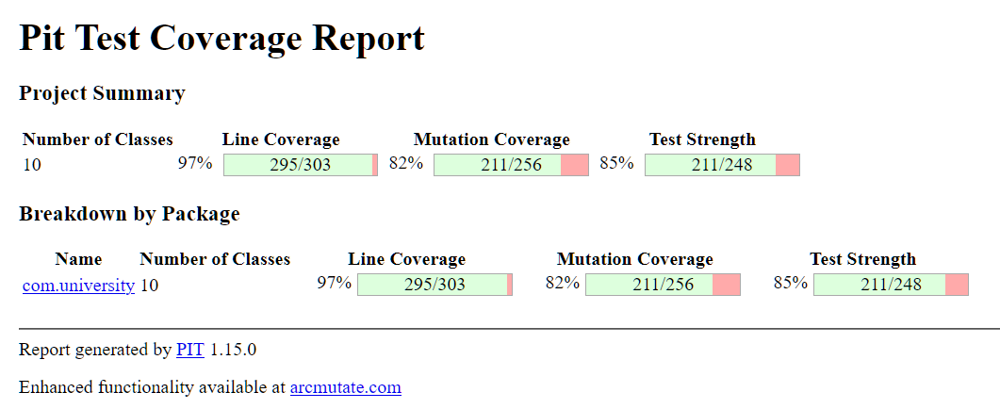

# University Management System
### CSE 731: Software Testing | Term I 2025-26  
**IIIT Bangalore**

---


## 👥 Team Members
1. [Hemant Gupta] – [IMT2022030]  
2. [Hemang Seth] – [IMT2022098]

---

## 📝 Project Description
This project implements a comprehensive backend system for a University, featuring Student Enrollment, Faculty Management, Library operations, and Departmental Budgeting.

The system is intentionally designed with complex boolean logic, mathematical accumulation, state management, and boundary conditions to demonstrate the effectiveness of **Mutation Testing**.

---

## 📊 Final Mutation Test Results

```

* Statistics
  ================================================================================

> > Line Coverage (for mutated classes only): 295/303 (97%)
> > Generated 256 mutations Killed 211 (82%)
> > Mutations with no coverage 8. Test strength 85%
> > Ran 584 tests (2.28 tests per mutation)

```
## 📊 Final Mutation Test Results




---

## 📂 Folder Structure & File Descriptions

```

UniversityMutationProject/
├── pom.xml                   # Maven configuration with PITest plugin
├── README.md                 # Project documentation
└── src/
├── main/java/com/university/
│   ├── Main.java              # Entry point
│   ├── Person.java            # Abstract base class
│   ├── Student.java           # GPA, credits, probation logic
│   ├── Faculty.java           # Tenure, salary, service years
│   ├── Course.java            # Capacity, enrollment, cancellation
│   ├── Department.java        # Budget calculation, hiring logic
│   ├── LibraryBook.java       # Book state (damage, availability)
│   ├── LibrarySystem.java     # Overdue fine calculation
│   ├── EnrollmentService.java # Integration of Student–Course rules
│   └── ValidationUtils.java   # Input validation utilities
│
└── test/java/com/university/
    ├── StudentTest.java          # Student GPA, credits, probation tests
    ├── FacultyTest.java          # Tenure, salary, service year tests
    ├── CourseTest.java           # Capacity, enrollment, cancellation tests
    ├── DepartmentTest.java       # Budget calculation, hiring logic tests
    ├── LibraryBookTest.java      # Book state (damage, availability) tests
    ├── LibrarySystemTest.java    # Overdue fine calculation tests
    ├── EnrollmentServiceTest.java# Integration of Student–Course rules tests
    ├── MainTest.java             # System entry point tests
    ├── PersonTest.java           # Abstract base class tests
    ├── ValidationUtilsTest.java  # Input validation utilities tests
    ├── ExceptionBoosterTest.java # Exception handling tests
    ├── BoundarySniperTest.java   # Conditionals boundary tests
    ├── SniperRound2Test.java     # Math and boolean logic tests
    ├── StateAccumulationTest.java# Accumulation of fine tests
    └── OutputCaptureTest.java    # Exception handling tests

````

---

## 🧬 Mutation Testing Details

### What is Mutation Testing?
Mutation testing evaluates the quality of the test suite by deliberately injecting small bugs (*mutants*) into the code.  
- If a test catches it → **Mutant killed** (Good)  
- If tests pass despite the bug → **Mutant survived** (Bad)

A high kill rate indicates a strong test suite.

---

### Mutation Operators Used

1. **Conditionals Boundary Mutator**  
   Changes `<` → `<=`, `>=` → `>`, etc.  
   *Example:* Damage threshold checks in `LibraryBook`.

2. **Math Mutator**  
   Replaces arithmetic operations `+`, `-`, `*`, `/`.  
   *Example:* Fine calculations in `LibrarySystem`.

3. **Negate Conditionals Mutator**  
   Negates boolean conditions.  
   *Example:* `if (isProbation)` → `if (!isProbation)`.

4. **Void Method Call Mutator**  
   Removes calls to void methods.  
   *Example:* Deletes `System.out.println` (caught by `OutputCaptureTest`).

5. **Return Values Mutator**  
   Changes return types (true/false, numeric defaults, etc.).

---

### Testing Levels

#### ✔ Unit Testing  
Each class (`Student`, `Faculty`, `LibraryBook`, etc.) is tested independently to verify internal logic and state transitions.

#### ✔ Integration Testing  
`EnrollmentService` tests ensure that enrollment rules (credit caps, probation blocks, capacity) work across multiple classes.

---

## 🚀 How to Run This Project (From Scratch)

### 1. Install Prerequisites (Java 17 + Maven)

```bash
sudo apt-get update
sudo apt-get install openjdk-17-jdk maven -y
````

---

### 2. Compile the Code

```bash
mvn clean compile
```

---

### 3. Run the Application (Demo Mode)

```bash
java -cp target/classes com.university.Main
```

Expected output begins with:

```
=== University System Starting ===
```

---

### 4. Run All Tests

```bash
mvn test
```

---

### 5. Run Mutation Testing (PITest)

```bash
mvn org.pitest:pitest-maven:mutationCoverage
```

---

### 6. View Mutation Report

* Open: `target/pit-reports/index.html`
* View full mutation matrix and killed/survived mutants.

---

## 🛠️ Tools & Technologies
* **Language:** Java (JDK 17)
* **Build Tool:** Maven
* **Test Framework:** JUnit 5
* **Mutation Tool:** [PITest (PIT)](https://pitest.org/) (Version 1.15.0)
* **IDE:** VS Code

## 🤖 AI Usage Declaration

*In compliance with course rules regarding AI assistance.*

### **Tool Used:** Google Gemini

### **Contribution:**

1. Generated initial boilerplate structure for `com.university` classes.
2. Suggested creation of "Sniper" test classes like `BoundarySniperTest` and `OutputCaptureTest`.
3. Provided PITest configuration snippet for `pom.xml`.

### **Verification:**

All AI-generated content was manually validated, corrected, and expanded by both team members.


